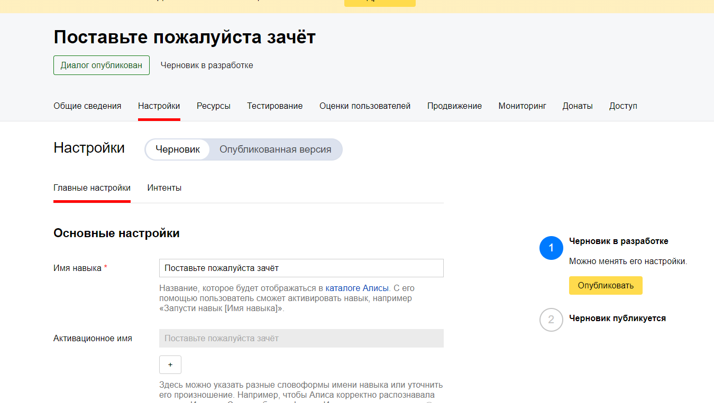

<p align="center">МИНИСТЕРСТВО НАУКИ  И ВЫСШЕГО ОБРАЗОВАНИЯ РОССИЙСКОЙ ФЕДЕРАЦИИ<br>
Федеральное государственное автономное образовательное учреждение высшего образования<br>
"КРЫМСКИЙ ФЕДЕРАЛЬНЫЙ УНИВЕРСИТЕТ им. В. И. ВЕРНАДСКОГО"<br>
ФИЗИКО-ТЕХНИЧЕСКИЙ ИНСТИТУТ<br>
Кафедра компьютерной инженерии и моделирования</p>
<br>
<h3 align="center">Отчёт по лабораторной работе № 2<br> по дисциплине "Программирование"</h3>
<br><br>
<p>студента 1 курса группы ПИ-б-о-202(1)<br>
Аблямитов Энвер Диляверович<br>
направления подготовки 09.03.04 "Программная инженерия"</p>
<br><br>
<table>
<tr><td>Научный руководитель<br> старший преподаватель кафедры<br> компьютерной инженерии и моделирования</td>
<td>(оценка)</td>
<td>Чабанов В.В.</td>
</tr>
</table>
<br><br>
<p align="center">Симферополь, 2020</p>
<hr>

Цель лабораторной работы:

1. Получить представления о структуре post-запроса;
2. Изучить webhooks как метод взаимодействия web-приложений;

## Постановка задачи

1. Разработать и зарегистрировать навык для Алисы на сервисе Яндекс.Диалоги;

2. В качестве backend-a для навыка реализовать приложение на языке С++ выполняющее следующие функции:

    - Составление продуктовой корзины:
    
        - Добавление продукта в корзину;
        - Удаление продукта из корзины;
        - Очистка корзины;
        - Вывод списка товаров в корзине;
        - Подсчёт стоимости товаров в корзине.

    - Вывод справочной информации по навыку;

    - Регистрацию webhook-ов сторонних сервисов;

    - Отправку данных на сторонние сервисы. 

3. В качестве стороннего сервиса реализовать приложение на языке Python, выполняющее следующие функции:
    - Ожидание данных о покупке;
    - Сохранение поступивших данных в excel-документ.
    
## Выполнение работы

Создаю навык,настраиваю его, присваиваю ему имя : "Поставьте пожалуйста зачёт".

1. Скриншот со страницы настроек навыка:



Рисунок 1. Скриншот настройки навыка.

2-3. Я не успел сделать серверное приложение, лишь создал оболочку функции, формирующий ответ Алисе и заготовки комманд,
поэтому, к сожалению, функционал Корзины и Помощи мне пока не доступны.
Поэтому вставлю скриншот нерабочего состояния навыка, учитывая тот код, который я успел написать.


Рисунок 2. Скриншот нерабочего навыка.

4. Скриншот страницы управления webhook-ами с добавленным webhook-ом клиентского приложения
Создаю веб-страницу для управления вебхуками. Перед этим создаю конфигурационный файл, откуда будет браться ссылка для вствки в шаблон html кода.
В коде, в функции отправляющей get-запрос я редактирую шаблон html файла и формирую ответ в формате get.
В коде, в функции отправляющей post-запрос я реализую принятие параметра, делаю соответствищие действия с ним в json файле и отправляю ответ в формате post с кодировкой utf-8. 


Рисунок 3. Скриншот страницы с webhook-ами.

Создаю клиентское приложения на языке программирования Python.
Это клиентское приложение создаст файл,а затем в содержимое файла будут записываться данные, которое мы добавляли в корзину в алисе(мы их будем брать от сервера с++).
К сожалению, из-за того, что навык не работает, я не им воспользоваться и данные не будут поступать на клиенсткое приложение. Именно поэтому я условно заполнил эксель файл ,непосредственно приписав к каждой ячейке пример. (однако код на Python написан полностью, и с полным сервером на с++ он бы работал и записывал данные в эксель как нужно).

5. Ссылка на эксель файл:
[excel файл](Python/data.xlsx)

6. Полный код серверного приложения, который я успел написать:
```
    #include <iostream>
    #include <string>
    #include <iomanip>
    #include <cpp_httplib/httplib.h>
    #include <nlohmann/json.hpp>

    using namespace httplib;
    using json = nlohmann::json;

    std::string remember_webhook_way;
    size_t webhooks_size;
    json write_config_file;
    int number = 0;
    std::ofstream write_in_txt_file("log.txt");


    void save_config_file(json config) {
        std::ofstream config_file("config.json");

        if (config_file.is_open()) {
            config_file << config.dump(4);
            config_file.close();
        }
        else {
            number++;
            write_in_txt_file << number << "." << u8" Не удалось открыть конфигурационный файл" << std::endl;
        }
    }


    std::string edit_webhook_template() {

        std::string webhooks_list = "{webhooks_list}";
        std::string Webhook_URL = "{Webhook URL}";
        std::string piece_of_HTML = u8R"(
    <div class="form-row align-items-center">
        <div class="col">
            <input type="how_to_write" value="{Webhook URL}" class="form-control mb-2" disabled>
        </div>
        <div class="col">
            <button type="submit" name="del" value="{Webhook URL}" class="btn btn-danger mb-2">Удалить</button>
        </div>
    </div>)";


        std::string webhooks_template;
        std::ifstream webhooks_file("Page.html");


        if (webhooks_file.is_open()) {
            getline(webhooks_file, webhooks_template, '\0');
            webhooks_file.close();
        }
        else {
            number++;
            write_in_txt_file << number << "." << u8" Не удалось открыть шаблон сайта" << std::endl;
            return "";
        }

        std::string one_piece_of_HTML;
        std::string full_piece_of_HTML;

        if (write_config_file["webhooks"].size() != 0) {
            for (int i = 0; i < write_config_file["webhooks"].size(); i++) {
                one_piece_of_HTML = piece_of_HTML;

                one_piece_of_HTML.replace(one_piece_of_HTML.find(Webhook_URL), Webhook_URL.size(), write_config_file["webhooks"][i]);
                one_piece_of_HTML.replace(one_piece_of_HTML.find(Webhook_URL), Webhook_URL.size(), write_config_file["webhooks"][i]);

                full_piece_of_HTML = full_piece_of_HTML + one_piece_of_HTML;
            }

            webhooks_template.replace(webhooks_template.find(webhooks_list), webhooks_list.size(), full_piece_of_HTML);
        }
        else {
            webhooks_template.replace(webhooks_template.find(webhooks_list), webhooks_list.size(), "");
        }
        return webhooks_template;
    }
    void edit_webhook_website(const Request& req, Response& res) {
        bool if_webhook_already_exist = false;
        if (req.has_param("set")) {

            if (req.get_param_value("set") == "") {
            }
            else {
                write_config_file["webhooks"].size();

                for (int i = 0; i < write_config_file["webhooks"].size(); i++) {

                    if (write_config_file["webhooks"][i] == req.get_param_value("set")) {

                        number++;
                        write_in_txt_file << number << "." << u8" Следующий вебхук уже есть: " << write_config_file["webhooks"][i] << std::endl;

                        if_webhook_already_exist = true;

                        break;
                    }
                }
                if (!if_webhook_already_exist) {

                    write_config_file["webhooks"].push_back(req.get_param_value("set"));

                    number++;
                    write_in_txt_file << number << "." << u8" Добавлен следующий вебхук:  " << req.get_param_value("set") << std::endl;

                }
            }
        }
        else if (req.has_param("del")) {

            for (int i = 0; i < write_config_file["webhooks"].size(); i++) {

                std::string remember_webhook_way = write_config_file["webhooks"][i];

                if (remember_webhook_way == req.get_param_value("del"))
                {
                    write_config_file["webhooks"].erase(write_config_file["webhooks"].begin() + i);

                    number++;
                    write_in_txt_file << number << "." << u8" Удалён следующий вебхук: " << remember_webhook_way << std::endl;
                    break;
                }
            }
        }
        save_config_file(write_config_file);
    }

    void webhooks_post(const Request& req, Response& res) {

        edit_webhook_website(req, res);


        res.set_content(edit_webhook_template(), "text/html; charset=UTF-8");

    }

    void webhooks_get(const Request& req, Response& res) {

        res.set_content(edit_webhook_template(), "text/html");

    }


    void alice(const Request& req, Response& res)
    {
        std::string received_a_command; //полученная команда
        std::string how_to_write;       //что ответим(письменно)
        std::string how_to_say;         //что ответим(устно)
        if (received_a_command == u8"помощь")//что выведем, когда получим команду помощь
        {
            how_to_write =
                u8"1. Говорить. Включает режим озвучивания голосом.\n"
                u8"2. Молчать. Выключает режим озвучивания голосом.\n"
                u8"3. Добавить в корзину. Добавляет в корзину товар.\n"
                u8"4. Удалить из корзины. Удаляет из корзины товар.\n"
                u8"5. Помощь. Перечисляет все возможности навыка.\n"
                u8"6. Совершить покупку. Записывает содержание корзины в эксель, а затем очищает корзину.\n"
                u8"7. Сумма. Выводит сумму всех товаров, находящихся в корзине.\n"
                u8"О чём рассказать подробнее?";
            how_to_say =
                u8"1. Говор+ить sil <[500]>. Включ+ает реж+им озв+учивания г+олосом sil <[500]>.\n"
                u8"2. Молч+ать sil <[500]>. Выключ+ает реж+им озв+учивания г+олосом sil <[500]>.\n"
                u8"3. Доб+авить в корз+ину sil <[500]>. Добавл+яет в корз+ину тов+ар sil <[500]>.\n"
                u8"4. Удал+ить из корз+ины sil <[500]>. Удал+яет из корз+ины тов+ар sil <[500]>.\n"
                u8"5. П+омощь sil <[500]>. Перечисл+яет все возм+ожности н+авыка sil <[500]>.\n"
                u8"6. Соверш+ить пок+упку sil <[500]>. Зап+исывает содерж+ание корз+ины в экс+ель, а зат+ем очищ+ает корз+ину sil <[500]>.\n"
                u8"7. С+умма sil <[500]>. Выв+одит с+умму всех тов+аров, наход+ящихся в корз+ине sil <[500]>.\n"
                u8"О чём рассказ+ать подр+обнее?";
        }
        if (received_a_command == u8"говорить" or received_a_command == u8"1")
        {
            how_to_write = u8"Говорить. С помощью этой команды можно включить голосовой помошник.\n"
                u8"О чём ещё рассказать?\n";
            how_to_say = u8"Говор+ить sil <[500]>. С п+омощью +этой ком+анды м+ожно включ+ить голосов+ой пом+ошник sil <[500]>.\n"
                u8"О чём ещё рассказ+ать?\n";
        }
        else if (received_a_command == u8"молчать" or received_a_command == u8"2")
        {
            how_to_write = u8"Молчать. С помощью этой команды можно отключить голосовой помошник.\n"
                u8"О чём ещё рассказать?\n";
            how_to_say = u8"Молч+ать sil <[500]>. С п+омощью +этой ком+анды м+ожно отключ+ить голосов+ой пом+ошник sil <[500]>.\n"
                u8"О чём ещё рассказ+ать?\n";
        }
        else if (received_a_command == u8"добавить в корзину" or received_a_command == u8"3")
        {
            how_to_write = u8"Добавить в корзину. С помощью этой команды можно добавить товар в корзину.\n"
                u8"О чём ещё рассказать?\n";
            how_to_say = u8"Доб+авить в корз+ину sil <[500]>. С п+омощью +этой ком+анды м+ожно доб+авить тов+ар в корз+ину sil <[500]>.\n"
                u8"О чём ещё рассказ+ать?\n";
        }
        else if (received_a_command == u8"удалить из корзины" or received_a_command == u8"4")
        {
            how_to_write = u8"Удалить из корзины. С помощью этой команды вы можете удалить товар из корзины.\n"
                u8"О чём ещё рассказать?\n";
            how_to_say = u8"Удал+ить из корз+ины sil <[500]>. С п+омощью +этой ком+анды м+ожно удал+ить тов+ар из корз+ины sil <[500]>.\n"
                u8"О чём ещё рассказ+ать?\n";
        }
        else if (received_a_command == u8"помощь" or received_a_command == u8"5")
        {
            how_to_write = u8"Помощь. С помощью этой команды можно узнать описание возможностей навыка.\n"
                u8"О чём ещё рассказать?\n";
            how_to_say = u8"П+омощь sil <[500]>. С п+омощью +этой ком+анды м+ожно узн+ать опис+ание возм+ожностей н+авыка sil <[500]>.\n"
                u8"О чём ещё рассказ+ать?\n";
        }
        else if (received_a_command == u8"выйти из помощи")
        {
            how_to_write = u8"Обращайся ещё";
            how_to_say = u8"Обращ+айся ещ+ё";
        }
        else if (received_a_command == u8"совершить покупку" or received_a_command == u8"6")
        {
            how_to_write = u8"Совершить покупку. С помощью этой команды можно закончить покупку, отправив в эксель файл содержимое корзины и после этого ваша корзина               очистится.\n"
                u8"О чём ещё рассказать?\n";
            how_to_say = u8"Соверш+ить пок+упку sil <[500]>. С п+омощью +этой ком+анды м+ожно зак+ончить пок+упку, отпр+авив в экс+ель файл содерж+имое корз+ины и п+осле +этого    в+аша корз+ина оч+истится sil <[500]>.\n"
                u8"О чём ещё рассказ+ать?\n";
        }
        else if (received_a_command == u8"сумма" or received_a_command == u8"7")
        {
            how_to_write = u8"Сумма. С помощью этой команды можно подсчитать сумму стоимости всех товаров, которые находятся в вашей корзине."
                u8"О чём ещё рассказать?\n";
            how_to_say = u8"С+умма sil <[500]>. С п+омощью +этой ком+анды м+ожно подсчит+ать с+умму ст+оимости всех тов+аров, кот+орые нах+одятся в в+ашей корз+ине sil <[500]>."
                u8"О чём ещё рассказ+ать?\n";
        }
        else //если пользователь ввёл команду, которой нету выше
        {
            how_to_write = u8"Вы ввели непонятную команду. Пожалуйста, внимательнее введите команду.";
            how_to_say = u8"Вы ввел+и непон+ятную ком+анду.Пож+алуйста, вним+ательнее введ+ите ком+анду.";
        }
        json temp;//пробный ответ
        temp = {
      "response", {
        "text", u8"Здравствуйте! Я помогу вам с покупками.",
        "tts" , u8"Здр+авствуйте! Я помог+у вам с пок+упками.",
        "end_session" , false
      },
      "session_state" , {
          "value", 10
      },
      "version" , "1.0"
        };
        res.set_content(temp.dump(4), "text/json; charset=UTF-8");
    }

    int main() {

        std::ifstream config_file("config.json");
        json write_config_file;

        if (config_file.is_open()) {

            config_file >> write_config_file;

        }
        else {

            write_config_file["webhooks"] = json::array();

        }

        Server svr;

        svr.Post("/webhooks", webhooks_post);
        svr.Get("/webhooks", webhooks_get);
        svr.Post("/alice", alice);
        number++;
        write_in_txt_file << number << "." << u8" Сервер запущен" << std::endl;

        svr.listen("localhost", 1234);
 }
```


 
 


